# AI Workout Coach — Entity Relationship Diagram

**Version:** 1.0 · **Scope:** Full v1.0 (all 4 phases) · **Engine:** PostgreSQL (relational)

Design decisions baked into this model:

- **Canonical catalogs** — `EXERCISE`, `MUSCLE_GROUP`, `RECOVERY_CARD`, `PLAYLIST` are shared reference tables, referenced by ID.
- **Versioned plans** — every weekly `WORKOUT_PLAN` is persisted (full history); `adapted_from_plan_id` links a week to the one it evolved from.
- **Planned vs. actual** — `WORKOUT_DAY` is the plan; `WORKOUT_SESSION` is the logged completion/skip. Voice notes, recovery cards, and form checks attach to the session.
- **Adaptation audit trail** — `VOICE_NOTE` is transient (deleted after 24h) but the derived `ADAPTATION` record is retained.
- **Normalized child lists** — `EXERCISE_SET`, `VOICE_NOTE_SIGNAL`, `FORM_CHECK_FEEDBACK_ITEM` are their own tables.
- **Full billing** — `SUBSCRIPTION` + `PAYMENT_TRANSACTION`.

```mermaid
erDiagram
    %% ============ IDENTITY & PROFILE ============
    USER ||--o{ AUTH_PROVIDER : "authenticates via"
    USER ||--|| ONBOARDING_PROFILE : "has"
    ONBOARDING_PROFILE ||--o{ INJURY_LIMITATION : "declares"
    MUSCLE_GROUP ||--o{ INJURY_LIMITATION : "affects"

    %% ============ EXERCISE CATALOG ============
    EXERCISE ||--o{ EXERCISE_MUSCLE_GROUP : "targets"
    MUSCLE_GROUP ||--o{ EXERCISE_MUSCLE_GROUP : "worked by"
    MUSCLE_GROUP ||--o{ RECOVERY_CARD : "stretched by"

    %% ============ PLAN (versioned weekly) ============
    USER ||--o{ WORKOUT_PLAN : "owns"
    WORKOUT_PLAN ||--o{ WORKOUT_PLAN : "adapted from"
    WORKOUT_PLAN ||--|| AUDIO_BRIEFING : "summarized by"
    WORKOUT_PLAN ||--o{ WORKOUT_DAY : "contains"
    PLAYLIST ||--o{ WORKOUT_DAY : "energizes"
    WORKOUT_DAY ||--o{ WORKOUT_DAY_EXERCISE : "prescribes"
    EXERCISE ||--o{ WORKOUT_DAY_EXERCISE : "used in"
    WORKOUT_DAY_EXERCISE ||--o{ EXERCISE_SET : "broken into"

    %% ============ EXECUTION / COMPLETION ============
    WORKOUT_DAY ||--o{ WORKOUT_SESSION : "logged as"
    USER ||--o{ WORKOUT_SESSION : "performs"
    WORKOUT_SESSION ||--o{ SESSION_RECOVERY_CARD : "shows"
    RECOVERY_CARD ||--o{ SESSION_RECOVERY_CARD : "shown in"

    %% ============ VOICE NOTE & ADAPTATION ============
    WORKOUT_SESSION ||--o| VOICE_NOTE : "reflected in"
    VOICE_NOTE ||--o{ VOICE_NOTE_SIGNAL : "extracts"
    EXERCISE ||--o{ VOICE_NOTE_SIGNAL : "references"
    VOICE_NOTE ||--o{ ADAPTATION : "drives"
    WORKOUT_SESSION ||--o{ ADAPTATION : "source of"
    WORKOUT_PLAN ||--o{ ADAPTATION : "applied to"
    WORKOUT_DAY ||--o{ ADAPTATION : "adjusts"
    EXERCISE ||--o{ ADAPTATION : "adjusts load of"

    %% ============ FORM CHECK (Phase 3) ============
    USER ||--o{ FORM_CHECK : "submits"
    EXERCISE ||--o{ FORM_CHECK : "analyzed for"
    WORKOUT_SESSION ||--o{ FORM_CHECK : "captured in"
    FORM_CHECK ||--o{ FORM_CHECK_FEEDBACK_ITEM : "returns"

    %% ============ BILLING (Phase 4) ============
    USER ||--|| SUBSCRIPTION : "subscribes"
    SUBSCRIPTION ||--o{ PAYMENT_TRANSACTION : "billed via"
    USER ||--o{ PAYMENT_TRANSACTION : "pays"

    %% ==================================================
    %%                    ENTITIES
    %% ==================================================
    USER {
        uuid id PK
        text display_name
        text email UK
        timestamptz created_at
        timestamptz updated_at
    }

    AUTH_PROVIDER {
        uuid id PK
        uuid user_id FK
        enum provider "email|google|apple"
        text provider_uid "unique per provider"
        text email
        timestamptz created_at
    }

    ONBOARDING_PROFILE {
        uuid id PK
        uuid user_id FK "1:1"
        enum primary_goal "build_muscle|lose_weight|endurance|general"
        enum equipment "full_gym|home_gym|none"
        int days_per_week "2|3|4|5+"
        enum experience_level "beginner|intermediate|advanced"
        timestamptz created_at
        timestamptz updated_at
    }

    INJURY_LIMITATION {
        uuid id PK
        uuid profile_id FK
        uuid muscle_group_id FK "nullable"
        text body_part
        text note
        bool active
        timestamptz created_at
    }

    MUSCLE_GROUP {
        uuid id PK
        text name UK "quads|hamstrings|chest|..."
        text region "upper|lower|core"
    }

    EXERCISE {
        uuid id PK
        text name UK
        text description
        enum equipment "full_gym|home_gym|none"
        enum exercise_type "strength|hypertrophy|cardio|mobility"
        bool is_form_check_supported "squat, calf_raise = true"
        timestamptz created_at
    }

    EXERCISE_MUSCLE_GROUP {
        uuid id PK
        uuid exercise_id FK
        uuid muscle_group_id FK
        enum role "primary|secondary"
    }

    RECOVERY_CARD {
        uuid id PK
        uuid muscle_group_id FK
        text stretch_name
        int duration_seconds
        text instruction "2-3 lines"
        timestamptz created_at
    }

    PLAYLIST {
        uuid id PK
        text youtube_playlist_id UK
        text title
        enum energy_level "high|medium|high_tempo|low"
        text genre
        text url
        timestamptz cached_at
    }

    WORKOUT_PLAN {
        uuid id PK
        uuid user_id FK
        uuid adapted_from_plan_id FK "nullable, self-ref"
        int week_number
        date week_start_date
        enum status "active|archived"
        text focus_summary
        timestamptz generated_at
        timestamptz created_at
    }

    WORKOUT_DAY {
        uuid id PK
        uuid plan_id FK
        uuid playlist_id FK "nullable, Phase 2"
        int day_of_week "1-7"
        bool is_rest_day
        text workout_name
        enum workout_type "strength|hypertrophy|cardio|mobility"
        int estimated_duration_min
    }

    WORKOUT_DAY_EXERCISE {
        uuid id PK
        uuid workout_day_id FK
        uuid exercise_id FK
        int order_index
        text notes
    }

    EXERCISE_SET {
        uuid id PK
        uuid workout_day_exercise_id FK
        int set_number
        int target_reps
        numeric target_weight "nullable, bodyweight = null"
        int target_rpe "nullable"
    }

    WORKOUT_SESSION {
        uuid id PK
        uuid workout_day_id FK
        uuid user_id FK
        enum status "completed|skipped"
        int duration_actual_min "nullable"
        timestamptz completed_at
        timestamptz created_at
    }

    SESSION_RECOVERY_CARD {
        uuid id PK
        uuid session_id FK
        uuid recovery_card_id FK
        int order_index
    }

    VOICE_NOTE {
        uuid id PK
        uuid session_id FK
        text audio_url "transient"
        text transcript "nullable"
        enum perceived_effort "easy|moderate|hard"
        enum fatigue_level "low|moderate|high"
        enum status "pending|processed|discarded"
        timestamptz recorded_at
        timestamptz expires_at "recorded_at + 24h"
    }

    VOICE_NOTE_SIGNAL {
        uuid id PK
        uuid voice_note_id FK
        uuid exercise_id FK "nullable"
        enum signal_type "effort|fatigue|exercise_difficulty"
        text value
        numeric confidence
    }

    ADAPTATION {
        uuid id PK
        uuid source_voice_note_id FK "nullable"
        uuid source_session_id FK
        uuid target_plan_id FK
        uuid target_workout_day_id FK "nullable"
        uuid target_exercise_id FK "nullable"
        enum adaptation_type "increase_load|decrease_volume|reduce_exercise_load|add_rest_day|none"
        text change_description
        timestamptz applied_at
        timestamptz created_at
    }

    AUDIO_BRIEFING {
        uuid id PK
        uuid plan_id FK "1:1"
        text audio_url
        int duration_seconds "<= 60"
        text script_text
        int session_count
        text focus_areas
        text intensity_change_note
        enum status "pending|available|archived"
        timestamptz available_from
        timestamptz played_at "nullable"
    }

    FORM_CHECK {
        uuid id PK
        uuid user_id FK
        uuid exercise_id FK
        uuid session_id FK "nullable"
        text video_url "transient, deleted after processing"
        int score "1-10, nullable"
        numeric confidence
        enum status "processing|completed|failed|low_confidence"
        text error_reason "nullable"
        timestamptz disclaimer_acknowledged_at "nullable"
        timestamptz created_at
    }

    FORM_CHECK_FEEDBACK_ITEM {
        uuid id PK
        uuid form_check_id FK
        int order_index
        text feedback_text
    }

    SUBSCRIPTION {
        uuid id PK
        uuid user_id FK "1:1 active"
        enum tier "free|premium"
        enum status "active|trialing|canceled|expired"
        enum provider "stripe|app_store|play_store"
        text provider_subscription_ref
        int price_cents
        char currency "ISO 4217"
        timestamptz current_period_start
        timestamptz current_period_end
        timestamptz started_at
        timestamptz canceled_at "nullable"
    }

    PAYMENT_TRANSACTION {
        uuid id PK
        uuid subscription_id FK
        uuid user_id FK
        enum provider "stripe|app_store|play_store"
        text provider_txn_ref
        int amount_cents
        char currency "ISO 4217"
        enum type "charge|refund"
        enum status "succeeded|failed|refunded"
        timestamptz occurred_at
    }
```

## Entity summary (24 tables)

| Group | Entities |
|---|---|
| Identity & Profile | `USER`, `AUTH_PROVIDER`, `ONBOARDING_PROFILE`, `INJURY_LIMITATION` |
| Catalogs | `MUSCLE_GROUP`, `EXERCISE`, `EXERCISE_MUSCLE_GROUP`, `RECOVERY_CARD`, `PLAYLIST` |
| Plan (versioned) | `WORKOUT_PLAN`, `WORKOUT_DAY`, `WORKOUT_DAY_EXERCISE`, `EXERCISE_SET`, `AUDIO_BRIEFING` |
| Execution | `WORKOUT_SESSION`, `SESSION_RECOVERY_CARD` |
| Adaptation | `VOICE_NOTE`, `VOICE_NOTE_SIGNAL`, `ADAPTATION` |
| Form check (P3) | `FORM_CHECK`, `FORM_CHECK_FEEDBACK_ITEM` |
| Billing (P4) | `SUBSCRIPTION`, `PAYMENT_TRANSACTION` |

## Notes & retention rules

- **Voice notes** (`audio_url`) and **form-check videos** (`video_url`) are deleted per PRD privacy rules (24h / after processing). The rows persist with the media reference nulled; derived data (`VOICE_NOTE_SIGNAL`, `ADAPTATION`, `FORM_CHECK*`) is retained.
- **Form-check history** is capped at the **last 10 per user** — enforce in application logic (prune oldest), not schema.
- **Plan versioning**: query the newest `WORKOUT_PLAN` per user by `week_number` / `week_start_date`; `status='active'` marks the current week, older weeks `archived`.
- **Injury exclusions**: join `INJURY_LIMITATION → MUSCLE_GROUP → EXERCISE_MUSCLE_GROUP` to filter exercises/recovery cards for affected muscle groups during plan generation.
- **Playlist uniqueness** ("no repeat two weeks running") is a generation-time constraint, not a DB constraint.
